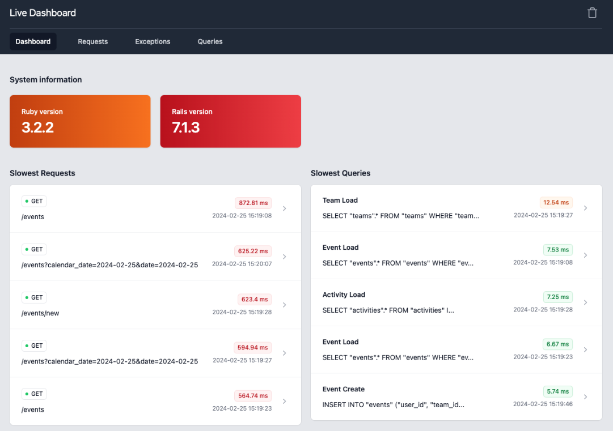

# RailsLiveDashboard

[](https://badge.fury.io/rb/rails_live_dashboard)

RailsLiveDashboard is a real-time debug dashboard for Rails applications. It provides insights into requests, queries, and exceptions, empowering developers to debug their applications effectively in development environments.

**Note: This gem is not recommended for production use, as it may potentially slow down your application and significantly increase your database size.**



## Installation

Add this line to your application's Gemfile:

```ruby
gem 'rails_live_dashboard'
```

We recommend adding it within your development gem group.

Then execute:

```bash
$ bundle install
```

Install migrations into your project:

```bash
$ rails rails_live_dashboard:install:migrations
```

Then run the migration:

```bash
$ rails db:migrate
```

To mount the RailsLiveDashboard routes and access the dashboard, add the following to your routes file:

```ruby
mount RailsLiveDashboard::Engine, at: '/live-dashboard' if Rails.env.development?
```

## Configuration

After installing RailsLiveDashboard, a configuration file will be created at config/initializers/rails_live_dashboard.rb:

```ruby
RailsLiveDashboard.configure do |config|
  config.enabled = true
end
```

You can configure it by setting:

- enabled: A boolean value to enable or disable RailsLiveDashboard subscribers.

## Contributing

We welcome contributions from the community to help enhance RailsLiveDashboard. Whether it's through bug fixes, feature enhancements, or documentation improvements, your contributions are invaluable in making RailsLiveDashboard even better!

To contribute, simply fork the repository, make your changes, and submit a pull request.

## License

The gem is available as open source under the terms of the [MIT License](https://opensource.org/licenses/MIT).
